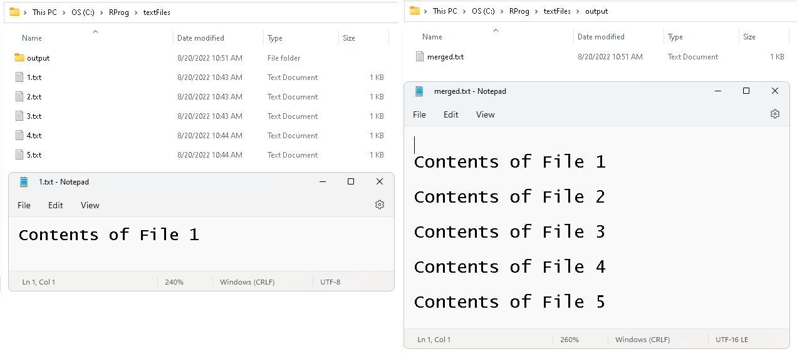

# sample-powershell-scripts
## As with all powershell scripts, USE WITH CAUTION

Some powershell scripts for text data-mining/cleaning applications

- Duplicate one file into N copies - click [here](https://raw.githubusercontent.com/sureshlazaruspaul/sample-powershell-scripts/main/duplicateFiles.ps1)
- Merge multiple text files into one file - click [here](https://raw.githubusercontent.com/sureshlazaruspaul/sample-powershell-scripts/main/mergeAllTxtFiles.ps1)

